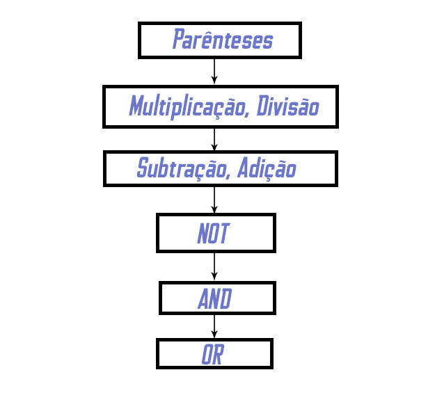

### 20.3 - Filtrando dados de forma específica


---

### Foco de Hoje

- WHERE
- IN & NOT IN
- BETWEEN
- Manipulação de datas
- LIKE

---

### Where 


---


Vamos encontrar o ator "JOHNNY CAGE"?


---

### Olha o Johnny aí

```sql
SELECT * FROM sakila.actor
WHERE first_name = 'JOHNNY' AND last_name = 'CAGE';
```

---

### 

Vamos dizer que eu quero o título e também quanto tempo cada filme ficou alugado dos filmes que ficaram alugados por exatamente 6 dias.

Dica: `sakila.film` tem essa informação.

---

###

```sql
--Resposta:
SELECT title, rental_duration FROM sakila.film
WHERE rental_duration = 6
-- Explicar que para valores exatos nós podemos simplesmente usar o sinal de igual
```

---

###

_Mas vamos dizer que além disso nós queremos somente os filmes com a classificação 'R' que foram alugados por 6 dias_

---

```sql
SELECT title, rental_duration, rating from SAKILA.FILM
WHERE rental_duration = 6 and rating = 'R';
```

---

_Porém, e se além da classificação for 'R' a gente quiser também incluir os filmes que possuem a classificação 'PG-13' que foram alugados por 6 dias? Como seria possível encontrá-los?_

---

```sql
SELECT title, rental_duration, rating from SAKILA.FILM
WHERE rental_duration = 6
AND (rating = 'PG-13' OR rating = 'R');
```

---

### Precedência de Operadores



---

### IN

Usar `OR` foi legal, mas nem sempre é a melhor solução. Sugestões?

---

### IN

```sql
SELECT * FROM sakila.film
WHERE title = 'AFFAIR PREJUDICE'
OR title = 'AFRICAN EGG'
OR title = 'AGENT TRUMAN'
OR title = 'AIRPLANE SIERRA';
```

---

### IN

```sql
SELECT * FROM sakila.film
WHERE title IN ('AFFAIR PREJUDICE', 'AFRICAN EGG', 'AGENT TRUMAN', 'AIRPLANE SIERRA');
```

---

### IN

Vamos reescrever?

```sql
SELECT title, rental_duration, rating from SAKILA.FILM
WHERE rental_duration = 6
AND (rating = 'PG-13' OR rating = 'R');
```

---

### IN

```sql
SELECT title, rental_duration, rating from SAKILA.FILM
WHERE rental_duration = 6
AND rating IN ('PG-13','R')
-- ORDER BY rating;
```

---

### IN

_Como eu poderia trazer nome e sobrenome de todos atores que não têm os seguintes sobrenomes: 'PECK' e HACKMAN'?_

---

### IN

```sql
SELECT first_name,last_name FROM sakila.actor
WHERE last_name NOT IN ('PECK', 'HACKMAN');
```

---

### IN

_E se quisermos todas as outras classificações menos 'PG-13','R'?_

```sql
SELECT title, rental_duration, rating from SAKILA.FILM
WHERE rental_duration = 6
AND rating IN ('PG-13','R')
-- ORDER BY rating;
```

---

### BETWEEN

Vamos pensar agora que você não tem uma lista completa dos filmes que tem a duração que você quer, mas o que você sabe é a duração que quer em um filme: entre 2 e 2.5 horas. Você não precisa ter os títulos neste caso.

---

### BETWEEN

```sql
SELECT title, length FROM sakila.film
WHERE length BETWEEN 120 and 150
ORDER BY length;
```

---

_Um outro cenário que podemos ter é caso você queira encontrar os nomes de B até D, mas não temos como ficar perdendo tempo para incluir cada um dos nomes de cada pessoa de B até D._

---

### BETWEEN - Ordem alfabética

```sql
SELECT * FROM sakila.actor
WHERE first_name BETWEEN 'B' AND 'D'
ORDER BY first_name;
```

---

### Ué??

Mas cadê??

```sql
SELECT * FROM sakila.actor
WHERE first_name BETWEEN 'BELA' AND 'DUSTIN'
ORDER BY first_name;
```

---

### Ordem alfabética

- _**B**_
- Bela
- Ben
- Cuba
- _**D**_
- Dan
- _**Du**_
- Dustin


---

_E podemos usar ainda para encontrar resultados dentro de uma faixa de resultados_
```sql
SELECT * FROM sakila.rental
WHERE return_date BETWEEN '2005-05-27' AND '2005-06-03'
```

---

### Datas

```sql
-- Reforçar que a data no SQL é armazenada no formato yyyy-mm-dd
SELECT now();  -- data e tempo de agora
SELECT curdate(); -- data de agora
SELECT curtime(); -- tempo de agora
SELECT year(now()); -- Ano atual
SELECT month(now()); -- mês atual
SELECT day(now()); -- dia atual
```

---

### Datas

```sql
-- Nós podemos encontrar todos os resultados em um determinado dia
SELECT * FROM sakila.rental
WHERE date(rental_date) = '2005-05-26';
```

---

### Datas

```sql
SELECT * FROM sakila.rental
WHERE rental_date BETWEEN CAST('2005-05-26 00:00:00' AS datetime) AND cast('2005-05-27 23:59:59' AS datetime);
```

---

### LIKE

Usado quando tempos informações parciais de algum campo.

---

### Pensemos

_Sua gestora está tendo problemas em lembrar o nome do cliente com que ele havia conversado ontem. Tudo o que ele lembra é que tinha um 'FER' no nome da pessoa. Podemos encontrá-la usando o like_

---

```sql
SELECT * FROM sakila.customer
WHERE first_name LIKE '%FER%';
```

---

### Representações

`%`  -> Uma cadeia de caracteres  
`_` -> Um único caracter


---

```sql
-- nomes que contem 'rey'
SELECT * FROM sakila.actor WHERE first_name LIKE '%rey%';
-- nomes finalizados com 'dra'
SELECT first_name FROM sakila.actor WHERE first_name LIKE '%dra';
-- nomes iniciando com 'jun'
SELECT first_name FROM sakila.actor WHERE first_name LIKE 'jun%';
-- Nomes que iniciam com 'J' e terminar com 'E'
SELECT * FROM sakila.actor WHERE first_name LIKE 'J%E';
-- Nomes que iniciam com RA a partir da segunda letra
SELECT * FROM sakila.actor WHERE first_name LIKE '_RA%';
-- Nomes que iniciam com ME a partir da terceira letra
SELECT first_name FROM sakila.actor WHERE first_name LIKE '__ME%';
-- Nomes com exatamente 3 caracteres
SELECT first_name FROM sakila.actor WHERE first_name LIKE '___';
-- Nomes com 3 caracteres que iniciam com B
SELECT first_name FROM sakila.actor WHERE first_name LIKE 'B__';
```

---
